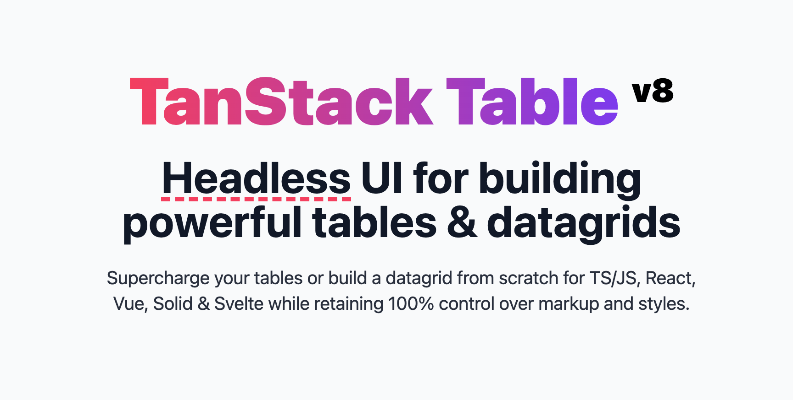

    
    <h1> Tanstack Table - React Sample</h1>

This repository was created with the intention of providing developers with a
sample of how to make a standardized implementation for a react app using
[TanStack Table](https://tanstack.com/table/v8)

# Development Tooling

### Testing Tools:

1. [Vitest](https://vitest.dev/)
2. [Jest DOM](https://github.com/testing-library/jest-dom)

### Documentation Standard

1. [TSDoc](https://tsdoc.org/)

# How to use it

1. Install pnpm globally in your machine. ([See the official docs](https://pnpm.io/installation))
2. Execute `pnpm run ci` to perform the instalation of all dependencies. (Read [this reference](https://betterprogramming.pub/npm-ci-vs-npm-install-which-should-you-use-in-your-node-js-projects-51e07cb71e26) for more details)
3. Execute `pnpm run dev`, and immediately you will see the vite server running.

# Requirements for daily development workflow

The development considered to be a candidate of a new version within the project,
should comply with the following criteria:

1. **Do not commit a new version if the development is not completed**. Each
   commit is expected to be associated to a single ticket number, it means that
   **only one commit is allowed per ticket assigned** (unless you have to perform a
   merge with main, this will be the extra commit allowed only)
2. **Each commit under the repo must deliver a stable version of the app**
3. The commit must state the title of the task/subtask that was taken
4. Add a description providing the answers to the following questions:
   - How the development in the branch will add value to the project?
   - Is there any remaining work to be done? Please, provide the ticket number
     that will cover this development

### _**EXCEPTIONS:**_

_If there's a need to merge something that wasn't initially scoped
(unexpected bug, or behaviour) it can be done but, following criteria:_

- _The commit description should state which was the issue that popped up and
  the temporal fix applied_
- _It has to reference the ticket that is created to cover that bug fixing,
  following scalability standards_

# IMPORTANT:

Make usage of the command `pnpm run commit:changes` in order to make a new commit.

When executed this will prompt you to define:

1. Type of change you're commiting (a list will be shown to you)
2. What is the scope of this change? (You can skip it, it is not necessary)
3. A short, imperative tense description of the change (Refer to step 3 from the previous list)
4. A longer description of the change (Refer to step 4 from the previous list)
5. Notify if there's a breking change
   - if yes, you'll have to provide details
   - if no, you'll be moved to the next step
6. Notify if this commit affect any open issues
   - if yes, you'll have to add the issue references
   - if no, you'll be moved to the next step
7. The commit will be added to the git history
8. You can push the prevously created commit to the remote repository

# UNDERSTANDING THE NATURE OF THE DEVELOPMENT:

The idea behind working with tables lies under the word _**requirements**_.
Whenever we have to implement one, we should ask ourselves:

- What do the table is
  required to do at this point of the development?
- Is it just supposed to be listing data?
- That listing should be _automatic_ or _controlled (server-side)_?
- Should we provide the user with CRUD actions, should we perform a global search.

Those question samples should better help of to direct the type of table we should
be creating, making the develper/user experience grow with it.

The concept of requirements previously stated, is tangible in the code through
the concept _**types**_. They are implementation approaches we can make usage
of in order to give life of our _**requirement**_. We can enhance each table type
with extra functionalities such as: multiple row selection, automatic/controlled
pagination, expandable rows, etc (again, based on requirements) and the can be
introduced incrementally.

## Table structure

Each table type has:

- index.tsx: Where table layout is done.
- useTableHelper.ts: Custom hook to manage data, columns and to provide
  functionalities to each table.

The table types you'll find here cover the most general elemental scenarios for
any project, the mindset explained here will serve as a guidance to come up with
more custom tables required in the project you're working on.
